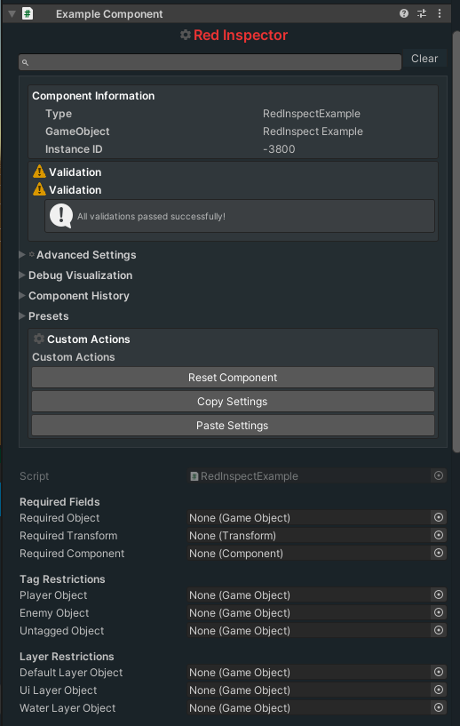

# Redline Inspector

The Unity3D Inspector Enhancer for Unity

## Features

- Enhanced inspector with visual customization
- Advanced validation system with automatic fixes
- Component state history and presets
- Debug visualization tools
- Custom styling and icons
- Advanced search functionality
- Validation attributes for components
- Automatic component dependency management



## Installation

### Using RPM/VCC/ALCOM (Recommended)

1. Open RPM, VCC, or ALCOM in your Unity project
2. Add the Redline repository URL: `https://rlist.arch-linux.pro/index.json`
3. Find RedInspect in the package list and install it

### Using Unity Package Manager (UPM)

1. Open the Package Manager window in Unity (Window > Package Manager)
2. Click the "+" button in the top-left corner
3. Select "Add package from git URL..."
4. Enter `https://github.com/Redline-Team/RedInspect.git`
5. Click "Add"

### Manual Installation

1. Download the latest release from the [Releases page](https://github.com/Redline-Team/RedInspect/releases)
2. Import the .unitypackage file into your Unity project

## Quick Start

1. Add the `[RedInspect]` attribute to your MonoBehaviour scripts
2. Use validation attributes to enforce requirements:
   ```csharp
   [RequireComponent(typeof(Rigidbody))]
   [Required("This field is required")]
   public class MyComponent : MonoBehaviour
   {
       [Tag("Player")]
       public GameObject playerObject;
       
       [Layer("UI")]
       public GameObject uiElement;
   }
   ```

## Documentation

For detailed documentation, please visit our [Documentation](Documentation/README.md) page.

## License

This project is licensed under the GPL-3.0 License - see the [LICENSE](LICENSE) file for details.

## Contributing

Contributions are welcome! Please read our [Contributing Guidelines](CONTRIBUTING.md) for details on our code of conduct and the process for submitting pull requests.

All contributors are expected to follow our [Code of Conduct](CODE_OF_CONDUCT.md).

## Credits

Developed by The Redline Team
